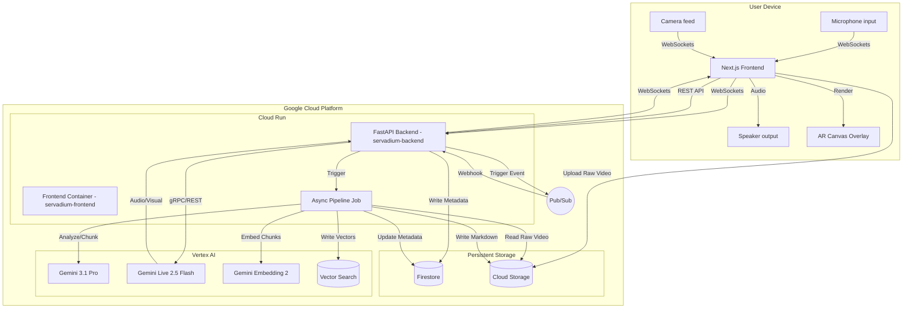
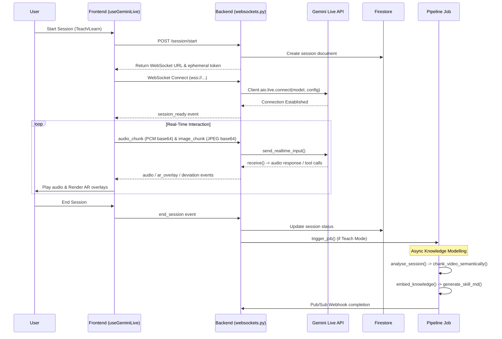

# Servadium


Servadium is a real-time multimodal knowledge transfer agent. 

It is an AI that learns and teaches expert knowledge. It uses AI to learn expert knowledge by observing human demonstrations, and then teaches learners by guiding them with real-time, low-latency conversational audio and precise AR visual overlays.

Built for the Google Gemini Live Agent Challenge. 

---

## Table of Contents

- [The Problem](#the-problem)
- [The Solution](#the-solution)
- [Features](#features)
- [Architecture](#architecture)
  - [System Architecture Diagram](#system-architecture-diagram)
  - [Agent Interaction Flow](#agent-interaction-flow)
  - [Data Model](#data-model)
  - [Component Map](#component-map)
- [Tech Stack](#tech-stack)
- [Gemini & Google Cloud Integration](#gemini--google-cloud-integration)
- [Repository Structure](#repository-structure)
- [Getting Started](#getting-started)
- [Deployment to Google Cloud](#deployment-to-google-cloud)
- [Hackathon Submission Checklist](#hackathon-submission-checklist)
- [How It Works — Technical Deep Dive](#how-it-works--technical-deep-dive)
- [API Reference](#api-reference)
- [Findings & Learnings](#findings--learnings)
- [Roadmap](#roadmap)
- [License](#license)
- [Acknowledgements](#acknowledgements)

---

## The Problem

Expert knowledge is often tacit, visual, and highly contextual. Traditional documentation formats—such as static text, recorded videos, or wikis—fail to capture the spatial and situational nuances of physical and complex digital tasks. When a learner attempts to replicate an expert's procedure using these static resources, they lack real-time course correction. If they deviate, hesitate, or make a critical error, the static manual cannot intervene, leading to frustration, failure, or unsafe practice. 

## The Solution

Servadium solves this by acting as a real-time multimodal knowledge transfer agent, operating in two distinct modes:

1. **Teach Mode**: An expert performs a task while the AI watches via camera and listens via microphone. The agent actively engages, asks clarifying questions, and identifies critical visual moments. It captures the entire context, semantically chunks the video, embeds the data, and permanently encodes the tacit knowledge into a structured markdown guide.
2. **Learn Mode**: A learner attempts the task while the AI monitors them. Leveraging the previously encoded expert knowledge, the AI provides immediate, context-aware corrective guidance. It interrupts verbally and renders Augmented Reality (AR) overlays onto the user's camera feed the exact moment they deviate from the correct procedure.

Multimodality is central to this solution, not merely decorative. The spatial context captured via continuous video streaming is strictly necessary for the AI to understand *what* is physically being done. Real-time audio ensures a fluid, conversational, and completely hands-free pacing.

---

## Features

- **Real-Time Gemini Live WebSocket Connection**: Implements low-latency, bidirectional audio streaming using PCM 16kHz via WebSockets, yielding fluid conversational interactions with the agent.
- **Multimodal Video Processing**: Streams 1 FPS base64-encoded JPEG frames taken directly from a canvas element to the Vertex AI Gemini model to maintain continuous visual context without saturating bandwidth.
- **Semantic Video Chunking Pipeline**: An asynchronous Cloud Run job utilizes Gemini 3.1 Pro to semantically analyze the raw teaching session, segment the video into highly relevant clips via `ffmpeg`, and upload them for later retrieval.
- **Automated Skill Documentation**: Distills raw session transcripts, detected knowledge gaps, and physical visual moments into a permanent, structured `skill.md` guide persisted in Google Cloud Storage.
- **AR Overlay System**: The Gemini model dynamically instructs the frontend to render AR components (`CIRCLE`, `ARROW`, `TEXT`, `FINGER`) directly over the user's live video feed to provide precise spatial and directional guidance.
- **Deviation Detection**: Emits real-time visual alerts via UI banners the moment the learner makes a critical error or deviates from the correct procedure.
- **Microphone RMS Voice Detection**: Client-side audio processing computes RMS volume to drive UI animations and user-speaking states without incurring round-trip latency.

---

## Architecture

### 6.1 — System Architecture Diagram



### 6.2 — Agent Interaction Flow



### 6.3 — Data Model

Data is stored primarily in Firestore, combined with binary assets in GCS.

**Firestore `sessions` Collection:**
| Field | Type | Description |
|---|---|---|
| `session_id` | String | Unique UUID for the session |
| `session_type` | String | `"teach"` or `"learn"` |
| `user_id` | String | Firebase UID of the user |
| `knowledge_id` | String / Null | Associated knowledge entry ID (if learning) |
| `status` | String | `"active"` or `"ended"` |
| `created_at` | Timestamp | Start time |
| `ended_at` | Timestamp | End time |
| `transcript` | String | Ongoing transcript |
| `recording_url` | String | `gs://[bucket]/sessions/[id]/raw_session.mp4` |
| `skill_md` | String | Distilled markdown generated by pipeline |
| `video_uploaded` | Boolean | GCS upload status |
| `modelling_complete` | Boolean | Pipeline job completion status |

**Firestore `knowledge` Collection:**
| Field | Type | Description |
|---|---|---|
| `id` | String | Document ID (usually matches originating `session_id`) |
| `title` | String | Name of the skill |
| `created_at` | Timestamp | Time of creation |
| `chunks_count` | Number | Amount of video segments extracted |
| `chunks` | Array | Objects containing `chunk_id`, `gcs_url`, `start_time_seconds`, `end_time_seconds`, `semantic_label` |

### 6.4 — Component Map

| Component | File(s) | Responsibility |
|---|---|---|
| **API Routers** | `backend/routers/*.py` | Handles REST API endpoints for sessions, websockets, and GCS/PubSub webhooks. |
| **Agent Pipeline** | `backend/pipeline/agent.py` | Orchestrates async session analysis, `ffmpeg` video chunking, embedding, and Markdown generation. |
| **DB & Storage Services** | `backend/db.py`, `backend/storage.py` | Abstracts interactions with Firestore and Cloud Storage (GCS signed URLs). |
| **Gemini Client** | `backend/gemini.py` | Defines system prompts and handles token minting for Vertex AI usage. |
| **Vector Engine** | `backend/vector.py` | Handles storing and querying embeddings in Vertex AI Vector Search. |
| **Live Connect Hook** | `frontend/src/hooks/useGeminiLive.ts` | Frontend heartbeat: establishes WS connection, handles browser `AudioContext`, processes camera input via `CanvasRenderingContext2D`, and detects RMS voice activity. |
| **AR Overlay Engine** | `frontend/src/hooks/useAROverlay.ts` | Listens for AR instructions from the backend and renders transient Canvas shapes over the video stream. |
| **Session UI** | `frontend/src/app/learn/[id]/page.tsx`, `teach/[id]/page.tsx` | Next.js routes composing the final video, transcript, control bars, and success modals. |
| **State Store** | `frontend/src/store/session.ts` | Zustand store managing session context, tokens, transcripts, and speaker states. |

---

## Tech Stack

| Layer | Technology | Version | Role |
|---|---|---|---|
| Frontend Framework | Next.js | `16.1.6` | App Router, SSR, overall frontend architecture |
| Frontend UI | React | `19.2.3` | UI components and rendering |
| Styling | Tailwind CSS | `^4` | Utility-first CSS styling framework |
| State Management | Zustand | `^5.0.11` | Client-side transient state |
| Backend API | FastAPI | `>=0.110.0` | High performance Python web framework |
| Server | Uvicorn | `>=0.27.1` | ASGI web server for FastAPI |
| Video Processing | FFmpeg | System | Slicing and chunking continuous video streams |
| Agent SDK | `google-genai` | `>=0.3.0` | Orchestrating Gemini Live and generation requests |
| Datastore | `google-cloud-firestore` | `>=2.15.0` | Document database for state and metadata |
| Object Storage | `google-cloud-storage` | `>=2.14.0` | Raw video and markdown storage |
| Vector Engine | `google-cloud-aiplatform` | `>=1.40.0` | Vector Search embeddings database |
| Auth & Events | `firebase`/`firebase-admin` | `^12.10.0`/`>=6.5.0` | Authentication identity provider |

---

## Gemini & Google Cloud Integration

**8.1 — Gemini Models Used**
- **Gemini Live**: `"gemini-live-2.5-flash-native-audio"` via the Vertex AI Live Connect API for ultra-low latency multimodal streaming.
- **Gemini 3.1 Pro**: `"gemini-3.1-pro-preview"` used heavily in the background asynchronous pipeline for analytical tasks (semantic chunking of video, Markdown synthesis, identifying ambiguities).
- **Gemini Embedding 2**: `"gemini-embedding-2-preview"` used to calculate multimodal vector embeddings for extracted video chunks.

**8.2 — SDK & Framework**
- Connects using the standard `google-genai` SDK version `0.3.0`.
- The Live API is instantiated directly via the `client.aio.live.connect` method in the backend proxy.

*Core SDK Instantiation (`backend/routers/websockets.py`):*
```python
client = genai.Client(
    vertexai=True,
    project=GOOGLE_CLOUD_PROJECT,
    location=GOOGLE_CLOUD_LOCATION,
    http_options={"api_version": "v1beta1", "async_client_args": {"ping_interval": None, "ping_timeout": None}},
)

config = types.LiveConnectConfig(
    response_modalities=["AUDIO"],
    system_instruction=types.Content(parts=[types.Part.from_text(text=system_instruction)]),
    speech_config=types.SpeechConfig(voice_config=types.VoiceConfig(
        prebuilt_voice_config=types.PrebuiltVoiceConfig(voice_name="Aoede")
    )),
)

async with client.aio.live.connect(model="gemini-live-2.5-flash-native-audio", config=config) as gemini_session:
    # Interaction loop
```

**8.3 — Google Cloud Services**

| Service | How It's Used | Key Config |
|---|---|---|
| **Cloud Run** | Hosts the containerized Next.js frontend, FastAPI backend, and the ephemeral background Worker Job. | Deployments utilize `us-central1` and `allow-unauthenticated`. |
| **Firestore** | Stores metadata for active sessions, user identifiers, and the generated list of semantic video chunks. | Uses the default named database. |
| **Cloud Storage** | Accepts large, raw `.mp4` video recordings directly from the user via v4 signed URLs. Stores generated `skill.md` artifacts and smaller video chunks. | Bucket: `GCS_BUCKET_NAME` env var. |
| **Cloud Pub/Sub** | Decouples the frontend from the background pipeline. Pipeline emits standard progress events which the backend proxies to WebSockets. | Topic ID passed via `PUBSUB_TOPIC_ID`. |
| **Vertex AI Vector Search** | The agent's long term memory. It indexes the embeddings returned by `gemini-embedding-2-preview` to allow the assistant to look up relevant visual moments during a "Learn" session. | Requires `VERTEX_AI_INDEX_ID` and `ENDPOINT_ID`. |

---

## Repository Structure

```
[project-root]/
├── .dockerignore              # Excludes local files from Docker Context
├── .gitignore                 # Excludes local files from Git
├── README.md                  # This definitive project documentation
├── backend/                   # Python FastAPI Backend
│   ├── main.py                # FastAPI app entrypoint
│   ├── auth.py                # Firebase authentication middleware
│   ├── db.py                  # Firestore intialization
│   ├── storage.py             # Google Cloud Storage signed URL generation
│   ├── gemini.py              # Vertex AI token minting and System Prompts
│   ├── vector.py              # Vertex AI Vector Search insertion/query wrapper
│   ├── trigger.py             # Code to manually trigger Cloud Run Jobs
│   ├── requirements.txt       # Python dependencies
│   ├── routers/               # API Endpoints
│   │   ├── session.py         # HTTP routes for initializing/retrieving sessions
│   │   ├── webhooks.py        # HTTP routes for PubSub and GCS event callbacks
│   │   └── websockets.py      # Core Gemini Live WS proxy handler
│   └── pipeline/              # Asynchronous agent modeling logic
│       ├── __main__.py        # Worker queue entrypoint
│       └── agent.py           # Logic for chunking video, embedding, and MD generation
├── frontend/                  # Next.js Application
│   ├── package.json           # Node dependencies and scripts
│   ├── next.config.ts         # Next.js bundler and runtime configuration
│   ├── .env.production        # Environment variables for production building
│   ├── public/                # Static assets (images, SVGs, manifest)
│   └── src/                   # React source code
│       ├── app/               # Next.js App Router definitions
│       │   ├── page.tsx       # Landing and Login page
│       │   ├── layout.tsx     # Standard layout and providers
│       │   ├── teach/         # The Teach Session interfaces
│       │   └── learn/         # The Learn Session interfaces
│       ├── components/        # Reusable React components (Knowledge cards, AR Canvas)
│       ├── hooks/             # Custom React hooks (useGeminiLive, useAROverlay)
│       ├── lib/               # Utility functions, API wrappers, and type definitions
│       └── store/             # Zustand global state managers
└── infra/                     # Infrastructure configuration files
    ├── cloudbuild.yaml        # Google Cloud Container Builder config
    ├── Dockerfile.backend     # Container file for the FastAPI service
    └── Dockerfile.frontend    # Container file for the Next.js standard output
```

---

## Getting Started

### 10.1 — Prerequisites

- **Node.js**: v20+
- **Bun**: v1+
- **Python**: 3.11+
- **FFmpeg**: System installed executable available in PATH
- **Google Cloud SDK**: Authenticated on your machine (`gcloud auth application-default login`)

### 10.2 — Installation

```bash
# Clone the repository
git clone https://github.com/servadium/servadium.git
cd servadium

# 1. Setup Backend
cd backend
python -m venv .venv
source .venv/bin/activate  # Or .venv\Scripts\activate on Windows
pip install -r requirements.txt
cd ..

# 2. Setup Frontend
cd frontend
bun install
```

### 10.3 — Environment Variables

Create `.env` files in both the `frontend/` and `backend/` directories.

**Backend (`backend/.env`):**
| Variable | Description | Required | Where to get it |
|---|---|---|---|
| `GCP_PROJECT_ID` | Internal GCP Project name | Yes | Google Cloud Console |
| `GEMINI_API_KEY` | Optional bypass if ADC is unavailable | No | Google AI Studio / GCP Console |
| `GCS_BUCKET_NAME` | Name of storage bucket | Yes | Cloud Storage |
| `VERTEX_AI_INDEX_ID` | Vector Search Index ID | Yes | Vertex AI Vector Search |
| `VERTEX_AI_ENDPOINT_ID` | Vector Search Endpoint ID | Yes | Vertex AI Vector Search |
| `PUBSUB_TOPIC_ID` | Used to report async pipeline state | Yes | Cloud Pub/Sub |
| `GOOGLE_APPLICATION_CREDENTIALS` | Path to service account JSON (local only) | No | IAM Service Accounts |

**Frontend (`frontend/.env.local`):**
| Variable | Description | Required | Where to get it |
|---|---|---|---|
| `NEXT_PUBLIC_API_URL` | URL to FastAPI backend (`http://localhost:8000`) | Yes | Run Locally / GCP run |
| `NEXT_PUBLIC_WS_URL` | Websocket URL (`ws://localhost:8000`) | Yes | Run Locally / GCP run |
| `NEXT_PUBLIC_FIREBASE_API_KEY` | Client Firebase API Key | Yes | Firebase Console |
| `NEXT_PUBLIC_FIREBASE_PROJECT_ID` | Client Firebase Project ID | Yes | Firebase Console |
| `NEXT_PUBLIC_FIREBASE_APP_ID` | Client Firebase App Identifier | Yes | Firebase Console |
| `NEXT_PUBLIC_FIREBASE_AUTH_DOMAIN`| Client Firebase Auth Domain | Yes | Firebase Console |
| `NEXT_PUBLIC_FIREBASE_STORAGE_BUCKET`| Client Firebase Storage Bucket | Yes | Firebase Console |
| `NEXT_PUBLIC_FIREBASE_MESSAGING_SENDER_ID`| Client Firebase Messaging ID | Yes | Firebase Console |

### 10.4 — Run Locally

Run the backend API:
```bash
cd backend
uvicorn main:app --host 0.0.0.0 --port 8000 --reload
```

Run the frontend app:
```bash
cd frontend
bun run dev
```

The application will be accessible at http://localhost:3000.

### 10.5 — Run with Docker

Two Dockerfiles are provided in the `infra/` folder.

```bash
# Build and run backend
docker build -t servadium-backend -f infra/Dockerfile.backend .
docker run -p 8080:8080 --env-file backend/.env servadium-backend

# Build and run frontend
docker build -t servadium-frontend -f infra/Dockerfile.frontend .
docker run -p 3000:3000 --env-file frontend/.env.production servadium-frontend
```

---

## Deployment to Google Cloud

The project includes an automated deployment configuration utilizing Cloud Build (`infra/cloudbuild.yaml`). Deployments push images and start unauthenticated Cloud Run instances.

**Automated Deployment**:
To deploy the whole stack automatically using Google Cloud Build:
```bash
gcloud builds submit --config infra/cloudbuild.yaml --substitutions=_REGION="us-central1",_REPO_NAME="servadium-repo",_BUCKET_NAME="[YOUR-BUCKET]",_INDEX_ID="[YOUR-INDEX]",_ENDPOINT_ID="[YOUR-ENDPOINT]",_PUBSUB_TOPIC="pipeline-events",_SERVICE_HASH="[TARGET-HASH]"
```

**Cloud Run Parameters Detected:**
| Parameter | Value |
|---|---|
| Machine Type (Builds) | `E2_HIGHCPU_8` |
| Region | `us-central1` (default) |
| Auth status | `--allow-unauthenticated` |
| Python Environment | `python:3.11-slim` with `ffmpeg` |
| Port bindings | Backend: `$PORT` / Frontend: `3000` |

---

## Hackathon Submission Checklist

```markdown
### Gemini Live Agent Challenge — Submission Requirements

#### Mandatory
- [x] Gemini model used — `gemini-live-2.5-flash-native-audio` and `gemini-3.1-pro-preview`
- [x] Built with Google GenAI SDK or ADK — `google-genai>=0.3.0`
- [x] Backend deployed on Google Cloud — Cloud Run on `us-central1`
- [x] Multimodal: moves beyond text-in/text-out — Native WebSockets audio with image frame extraction
- [x] Category selected: Live Agents
- [x] Gemini Live API used — Confirmed (`client.aio.live.connect`)

#### Submission Materials
- [x] Text description
- [x] Public code repository URL
- [x] README with spin-up instructions (this document)
- [x] Architecture diagram — §6.1
- [x] Proof of Google Cloud deployment — §11
- [x] Demo video 
- [x] Automated cloud deployment (IaC) — `infra/cloudbuild.yaml`
```

---

## How It Works — Technical Deep Dive

When a user initiates a session, `frontend/src/app/page.tsx` directs them to either the Teach or Learn component. Let's step through the Teach mode lifecycle.

1. **Authentication and Session Initialization**: The `useAuth` hook grabs the user's Firebase token. It invokes `lib/api.ts` `createSession()`, sending a REST POST to the FastAPI backend (`backend/routers/session.py`). The backend mints an ephemeral API key and a temporary system prompt instruction from `backend/gemini.py` and establishes an active document in Firestore (`db.py`), passing the new `session_id` to the frontend.
2. **WebSocket & Media Acquisition**: With the `session_id` secured, `useGeminiLive.ts` calls `navigator.mediaDevices.getUserMedia` for 16kHz audio and 720p video. It instantly establishes a WebSocket connection to `backend/routers/websockets.py`.
3. **Backend Proxying**: The backend intercepts this connection, initializes the `google-genai` client, and calls `client.aio.live.connect` utilizing the `gemini-live-2.5-flash-native-audio` model. The Live API connects and responds; the backend echoes a `session_ready` event to the component.
4. **Streaming Data to Gemini**:
   - *Audio*: Using a web audio `ScriptProcessorNode`, the microphone signal is split. RMS volume triggers UI animations. The raw float signal is converted to 16-bit PCM integer arrays, base64 encoded, and chunked through the WebSockets. The backend funnels this as `audio/pcm` directly to Gemini via `send_realtime_input`.
   - *Video*: The video stream renders to a hidden `canvas`. Every second, `canvas.toDataURL()` rips a high-quality JPEG which is shipped across WebSockets. The backend submits it synchronously behind the audio frames to the Gemini instance.
5. **Receiving Data from Gemini**:
   - *Audio Playback*: When Gemini responds, the `websockets.py` listener pulls `inline_data` out of `model_turn.parts`. Base64 Audio PCM representations are blasted through WebSockets down to the client. The frontend decodes the data and schedules standard buffered playback on an `AudioContext`. 
   - *Tool calls*: If Gemini invokes the AR Tool, a custom `ar_overlay` JSON structure triggers `useAROverlay.ts`, updating local React state to draw shapes immediately on the visible camera canvas structure over the browser window.
6. **Task Modeling Pipeline**: Upon session termination, the backend routes an event via `run_v2.JobsClient` using `trigger.py`. This starts a heavy, segregated background job defined in `backend/pipeline/agent.py`.
7. **Semantic Understanding**: The pipeline extracts the raw transcript and uses `gemini-3.1-pro-preview` to identify exactly *when* critical visual moments occurred during the recording. It generates a "chunk plan" containing `start_time_seconds` and `end_time_seconds`. 
8. **Video Processing and Embedding**: The server fires headless `ffmpeg` commands via sub-processing to slice the massive raw file into precise 10-120 second chunks. These standalone semantic chunks are shipped to Google Cloud Storage. `gemini-embedding-2-preview` embeds the multimodal (video, audio, spoken word) chunks, pushing the output mathematically precise values directly into Vertex AI Vector Search.
9. **Final Output Formulate**: A Markdown specification is generated via Gemini encapsulating all discovered prerequisites, potential hazards, structural notes, and the timestamped transcript. It generates the `skill.md` guide.
10. **Webhook Return**: Finally, a Pub/Sub event is triggered. `backend/routers/webhooks.py` catches this push and forwards it directly to the end user's waiting WebSocket connection, updating the React UI component's state to "Finished Modeling".

---

## API Reference

### HTTP Endpoints

- **`POST /session/start`**
  - Begins a new Teach or Learn interaction.
  - Body: `{ session_type: string, knowledge_id: string|null }`
  - Returns: `{ session_id, ephemeral_token, gcs_signed_url, system_instruction }`
- **`GET /health`**
  - Returns backend uptime and basic health ping.
- **`GET /health/firestore`**
  - Verifies database connectivity.
- **`GET /protected`**
  - Diagnostic echo for token verification. Passes if `Authorization: Bearer <token>` is verified via Firebase Admin SDK.
- **`POST /webhooks/gcs`**
  - Ingress configuration for Eventarc. Notifies the backend when massive video files land in GCS storage.
- **`POST /webhooks/pubsub`**
  - Standard REST push endpoint bridging PubSub async completion events back into the active WebSocket manager structure.

### WebSocket Endpoints

- **`ws://[backend_host]/ws/{session_id}`**
  - Upgrades connection for continuous duplex communication.

---

## Findings & Learnings

1. **Audio Feedback Loop Suppression**: When broadcasting `ScriptProcessorNode` data to a server and subsequently hearing backend responses from the speaker, AEC (Acoustic Echo Cancellation) algorithms often erroneously mute the microphone track. To preserve audio flow and satisfy the browser's implicit anti-feedback rules, we intentionally routed the input processor stream through a `GainNode` set to zero value before terminating at `AudioContext.destination`.
2. **Video Streaming Saturation against Live Connect Limits**: Pushing 24 FPS base64 video payloads through WebSocket architecture overwhelmed the Gemini Live input queues, resulting in stuttering and disconnects. Downgrading the extraction procedure via synchronous hidden canvas elements to stream one high-quality JPEG frame per second effectively preserved full spatial context while solving the throughput constraints.
3. **Implicit Subprocess Freezing during Chunking**: Utilizing headless `ffmpeg` inside the Cloud Run worker (`backend/pipeline/agent.py`) without `stdout=subprocess.DEVNULL` resulted in blocking process queues when pipe limits filled unexpectedly. Managing memory accurately via `check=True` and dumping errors solved our asynchronous segmentation failures.
4. **Vertex AI Connection Timeouts in Cloud Run**: When establishing the Vertex `aio.live.connect` stream, we frequently hit undocumented internal Cloud Run idle timeouts when audio was stagnant. We worked around this by applying specific initialization arguments `{"ping_interval": None, "ping_timeout": None}` exposed by the new `google-genai` SDK HTTP configuration options.
5. **Real-time RMS Voice Detection Advantage**: Depending exclusively on the backend LLM's server-side voice activity detector introduced significant UI latency. We migrated to calculating the raw RMS volume via `Math.sqrt` calculations from `Float32Array` values within the browser audio callback itself, bringing the volume ring and speaking notifications down to sub-ms perceived response times.

---

## Roadmap

| Feature | Status | Notes |
|---|---|---|
| **Implement Native MediaRecorder API** | Needs Setup | Raw upload video currently relies on signed URLs; direct RTC extraction is cleaner. |
| **Enhanced AR Shapes** | Needs Setup | Add lines, polygons, and depth-aware mappings based on Gemini spatial coordinates. |
| **GCP Identity Aware Proxy** | Future Work | Hardening authentication beyond simple Firebase UI tokens. |

---

## License

This project is licensed under the MIT License - see the [LICENSE](LICENSE) file for details.

---

## Acknowledgements

**Google, Google DeepMind, Google Cloud Platform**: For the development of Gemini, Google GenAI SDK, and Gemini Live Agent Challenge.
